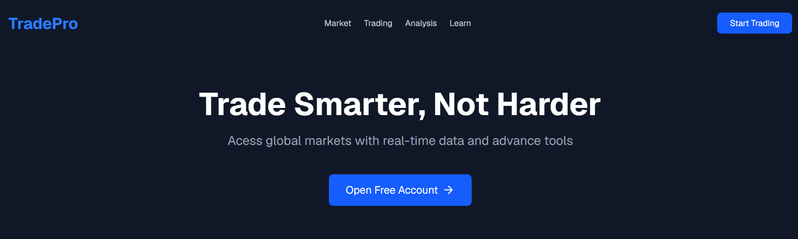
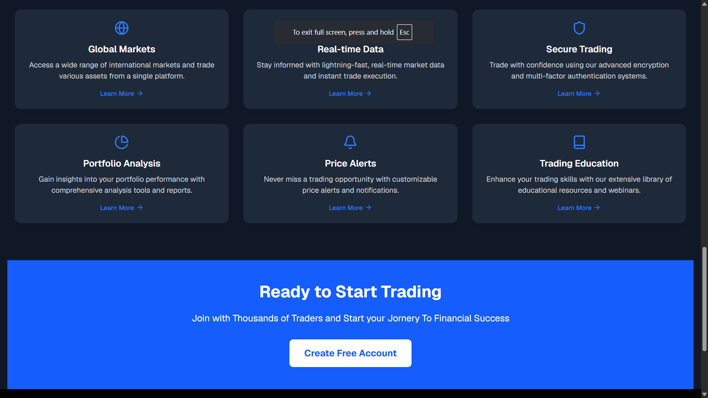
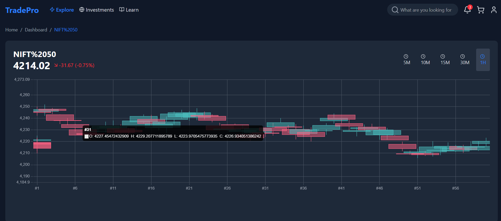
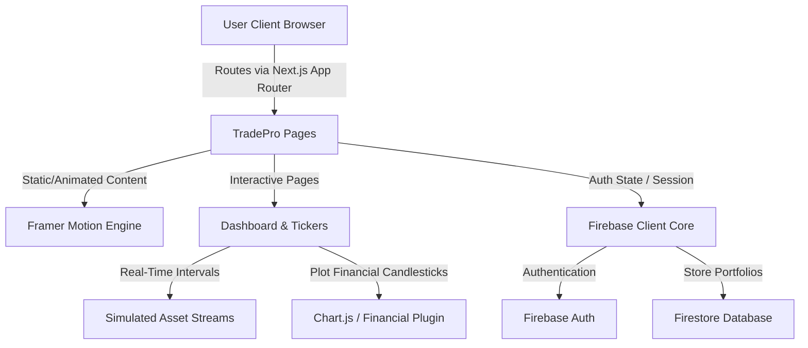

    # 🚀 TradePro — Next-Gen Real-Time Financial Trading & Technical Analysis Platform

[](https://nextjs.org)
[](https://react.dev)
[](https://tailwindcss.com)
[](https://firebase.google.com)
[](https://www.chartjs.org)
[](https://www.framer.com/motion/)

Welcome to **TradePro**, an ultra-premium, dark-themed digital trading and investments dashboard built using **Next.js 16 (App Router)**, **React 19**, and **Tailwind CSS**. TradePro integrates simulated live-ticker data streams with dynamic candlestick plotting and Firebase database authentication to deliver a professional-grade technical analysis experience right inside your web browser.

---

## 🔗 Live Showcase & Links

- 🌐 **Live Demo:** [https://tradepro-showcase.vercel.app](https://github.com/himesh-mehta/Trade-Pro) *(Replace with your deployed Vercel URL)*
- 💻 **GitHub Repository:** [https://github.com/himesh-mehta/Trade-Pro](https://github.com/himesh-mehta/Trade-Pro)
- 📊 **Firebase Project Portal:** [https://console.firebase.google.com](https://console.firebase.google.com)

---

## 🎨 Visual Preview & Showcase

### 🖥️ 1. Main Landing Page & Feature Hub
A beautiful glassmorphic home page featuring modern dark-mode aesthetics, rich micro-animations, and smooth scrolling.


### 📊 2. Dynamic Live Ticker & Market Indices Dashboard
The central terminal showcasing live fluctuating indices (Nifty 50, Bank Nifty, Sensex), most-bought stock cards (Reliance, Tata Motors, TCS) with animated price tickers, and a market capitalization listing.


### 📈 3. Advanced Candlestick Technical Analysis Charting Room
A specialized charting room showcasing interactive simulated live tickers, multi-timeframe controls (5M, 10M, 1H), and high-fidelity candlestick charting.


---

## 🔥 Key Features

- **⚡ Real-Time Asset Simulator**: Simulated market ticker prices (Nifty 50, Bank Nifty, Sensex, Reliance, Tata Motors, TCS, and more) updating with fluid green/red price adjustments and flashing percentage tickers every second.
- **📊 Technical Charting Suite**: Interactive candlestick graphs powered by `chartjs-chart-financial` and `react-chartjs-2`, allowing customizable analysis timeframes (`5M`, `10M`, `15M`, `30M`, `1H`) and dynamic live candle additions.
- **✨ Fluid Micro-Animations**: Page transitions, hover effects, scale transformations, and layout springs built seamlessly with **Framer Motion** for a premium, native-app-like feel.
- **🔐 Firebase Authentication & Cloud Database**: Pre-configured setup for user session management (`login`, `signup`) and firestore database synchronization.
- **📱 Ultra-Responsive UX**: Carefully tailored layouts designed for mobile, tablet, and widescreen desktop displays utilizing modern flexbox and grid components.

---

## 🛠️ Architecture & Data Flow



---

## 📂 Project Structure

```bash
Trade-Pro/
├── app/                      # Next.js App Router Directory
│   ├── auth/                 # Authentication Pages (Login/Signup)
│   ├── dashboard/            # Dynamic Stock and Market Dashboards
│   │   ├── [id]/             # Stock Details Page with candlestick charts
│   │   └── page.tsx          # Dashboard Landing Tickers & Market cap lists
│   ├── layout.tsx            # Main HTML Shell & Font Injection
│   ├── page.tsx              # Home / Landing Page
│   └── globals.css           # Global Styles & Custom Utilities
├── components.json           # UI Components Configuration
├── lib/                      # Common Utilities & Configurations
│   ├── firebase.js           # Firebase Client Setup
│   └── utils.ts              # Tailwind Merge Class Utility
├── public/                   # Public Static Assets
│   ├── landing_page.png      # Home & Landing Page Preview
│   ├── dashboard_view.png    # Stocks, Mutual Funds & Indices Dashboard
│   └── technical_charts.png  # Live Candlestick Stock Charting Preview
├── package.json              # Project Configuration & Dependencies
└── tsconfig.json             # TypeScript Configuration
```

---

## ⚙️ Getting Started & Installation

To run TradePro locally on your system, follow these simple steps:

### 1. Prerequisites
Make sure you have **Node.js** (v18.x or later) installed on your machine.

### 2. Clone the Repository
```bash
git clone https://github.com/himesh-mehta/Trade-Pro.git
cd Trade-Pro
```

### 3. Install Dependencies
Install all required modules securely using `npm`:
```bash
npm install
```

### 4. Setup Environment Variables
Create a `.env.local` file in the root of the project directory and configure your Firebase keys:
```env
NEXT_PUBLIC_FIREBASE_API_KEY=your_api_key
NEXT_PUBLIC_FIREBASE_AUTH_DOMAIN=your_auth_domain
NEXT_PUBLIC_FIREBASE_PROJECT_ID=your_project_id
NEXT_PUBLIC_FIREBASE_STORAGE_BUCKET=your_storage_bucket
NEXT_PUBLIC_FIREBASE_MESSAGING_SENDER_ID=your_messaging_sender_id
NEXT_PUBLIC_FIREBASE_APP_ID=your_app_id
```

### 5. Launch the Development Server
Run the local dev compiler:
```bash
npm run dev
```
Open **[http://localhost:3000](http://localhost:3000)** in your browser to explore the TradePro interface!

---

## 🛠️ Main Libraries & Technologies Used

- **Framework**: [Next.js 16](https://nextjs.org/) (App Router & React Server Components)
- **Styling**: [Tailwind CSS v4](https://tailwindcss.com/)
- **Charts**: [Chart.js](https://www.chartjs.org/) + [chartjs-chart-financial](https://github.com/chartjs/chartjs-chart-financial)
- **Animations**: [Framer Motion](https://www.framer.com/motion/)
- **Backend Integrations**: [Firebase Web SDK v12](https://firebase.google.com/)
- **Icons**: [Lucide React](https://lucide.dev/)

---

## 🤝 Contributing

We welcome contributions of any size! If you want to contribute, please follow these steps:
1. **Fork** the repository.
2. Create a new feature branch (`git checkout -b feature/cool-feature`).
3. Commit your changes (`git commit -m 'feat: Add a cool feature'`).
4. Push to the branch (`git push origin feature/cool-feature`).
5. Open a **Pull Request**.

---

## 📄 License

This project is licensed under the **MIT License**. Check out the [LICENSE](LICENSE) file for more information.

---

*Made with ❤️ for modern traders.*
